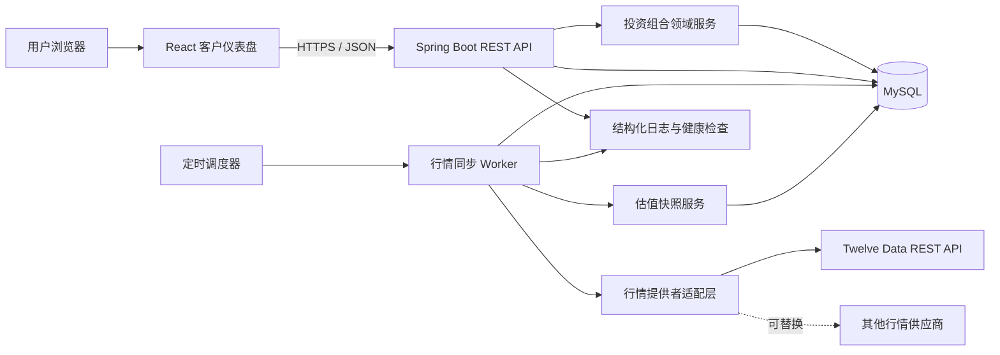
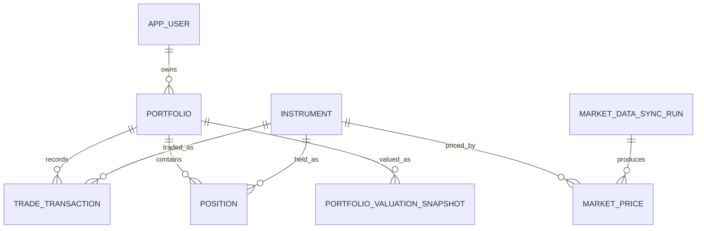

<!-- generated-by: gsd-doc-writer -->

# Portfolio Manager 整体项目架构

## 1. 文档定位

本文是 Portfolio Manager 的待实现架构基线，不代表仓库中已经存在相应代码。当前仓库只有课程说明文件 [project_description.pdf](../project_description.pdf)，因此下述技术栈、目录、接口和运行方式均属于团队开发约定。

课程要求是：用户管理由股票和 ETF 构成的投资组合；系统使用真实市场价格更新组合价值、收益/亏损和资产配置；前端以交互图表展示资产配置；后端轮询每日收盘价；演示应呈现“可直接面向客户”的仪表盘。

## 2. 目标与边界

### 2.1 MVP 目标

- 管理一个或多个股票/ETF 投资组合。
- 通过买入、卖出交易维护当前持仓与平均成本。
- 使用最新可用的日收盘价计算市值、未实现盈亏、收益率和资产配置。
- 提供响应式、可交互且具有清晰加载/错误/陈旧数据状态的客户仪表盘。
- 通过 REST API 保存与查询系统核心记录。
- 每日自动同步行情，并支持演示时手动触发同步。
- 外部行情服务暂时不可用时，继续显示最后一次成功行情并标记数据状态。

### 2.2 MVP 明确不做

- 不提供流式或逐笔盘中行情。“实时”在本项目中表示“外部市场数据驱动的最新可用日收盘价”，不是 WebSocket 实时报价。
- 不支持期权、债券、加密货币、卖空、融资融券或衍生品。
- 不处理股息、拆股、税务和复杂公司行动。
- 不做多币种换汇；MVP 组合与标的统一按 USD 计价。
- 不承诺生产级交易执行、投资建议或监管合规。
- 用户登录可延后；MVP 可使用预置演示用户，但数据模型保留多用户边界。

## 3. 技术基线

| 层 | 建议技术 | 选择理由 |
|---|---|---|
| Web 前端 | React、TypeScript、Vite | 组件化、开发反馈快，适合五人并行 |
| 数据请求 | TanStack Query | 统一缓存、重新获取和错误状态 |
| 图表 | Chart.js 与 react-chartjs-2 | 能快速实现环形图、折线图和交互提示 |
| API 后端 | Java 21、Spring Boot 4.1、Spring MVC、Bean Validation | Java LTS 基线，成熟的分层、校验和生产运维能力 |
| ORM/迁移 | Spring Data JPA、Hibernate、Flyway | 将领域实体、查询仓储和数据库迁移分离 |
| 行情适配 | Twelve Data REST 为首个实现，保留 provider 接口 | 与 Java HTTP 客户端自然集成，并覆盖股票与 ETF 历史日线 |
| 轮询进程 | 独立 Spring Boot worker + `@Scheduled` | 避免 Web 进程横向扩容时重复执行任务 |
| 数据库 | MySQL 8.0、InnoDB | 支持精确小数、事务、约束、视图和行级锁 |
| 本地运行 | Docker Compose | 统一前端、API、worker 和数据库环境 |
| 测试 | Vitest、React Testing Library、JUnit 6、Spring Boot Test、Playwright | 覆盖单元、接口和端到端关键路径 |

外部行情提供者必须通过 `MarketDataProvider` 接口访问，领域计算不得直接依赖 Twelve Data。若后续改用其他供应商，只替换 provider 适配器和配置，不修改组合计算规则。

## 4. 高层组件图



## 5. 组件职责

| 组件 | 核心职责 | 不负责 |
|---|---|---|
| React 客户仪表盘 | 页面布局、组合选择、摘要卡、持仓表、资产配置图、历史趋势图、状态反馈 | 自行计算权威盈亏、保存 API 密钥 |
| Spring Boot REST API | 输入校验、资源权限、组合/交易 CRUD、查询聚合、标准错误响应 | 直接调用第三方行情 API |
| 投资组合领域服务 | 交易规则、持仓更新、成本基础、估值与配置计算 | 前端展示逻辑、调度时钟 |
| 行情提供者适配层 | 将外部数据规范化为内部日收盘价格式 | 写入组合交易、计算用户权限 |
| 行情同步 Worker | 定时拉取、批处理、重试、幂等写入、同步运行记录 | 接收用户页面请求 |
| 估值快照服务 | 在行情同步后生成每日组合总值、成本和盈亏快照 | 保存逐笔行情 |
| MySQL | 关系约束、InnoDB 事务、最后可用价格、汇总视图 | 调用外部 API |

## 6. 核心数据模型



关键规则：

- 交易记录是业务事实，创建后不直接修改；更正使用冲销或补充交易。
- 当前持仓是为快速查询维护的投影，必须与交易写入处于同一数据库事务。
- 行情按“标的 + 交易日 + 数据源”唯一，重复轮询使用 upsert，不产生重复记录。
- 每个标的可以保留多日历史价格；读取估值时选择最新一条有效日收盘价。
- 每个组合每天最多生成一条估值快照，重复生成时覆盖同日快照。
- 详细 DDL、约束、索引和计算视图见 [数据库脚本](database/schema.sql)。

## 7. 关键数据流

### 7.1 新建组合与录入买入交易

1. 用户在前端创建组合，选择 USD 作为基准币种。
2. 用户搜索并选择股票或 ETF，输入买入数量、成交价、费用和成交时间。
3. API 校验标的状态、数量、价格与幂等键。
4. 领域服务在一个数据库事务中写入交易，并新增或更新持仓数量和加权平均成本。
5. API 返回规范化持仓；前端刷新组合摘要和配置图。
6. 若该标的尚无行情，页面显示“等待行情”，而不是将价格或盈亏默认为零。

### 7.2 每日行情同步

1. 调度器在配置的收盘后时间触发独立 worker。
2. worker 查询所有活跃持仓涉及的标的，并创建一条同步运行记录。
3. 行情适配层分批获取最新日线数据，统一代码、日期、币种、收盘价和来源。
4. worker 对每条价格执行幂等 upsert；单个标的失败不会回滚其他成功标的。
5. worker 为受影响组合重新生成当日估值快照。
6. 同步运行记录保存成功、失败和错误摘要，供健康检查与演示页面读取。

### 7.3 仪表盘读取

1. 前端请求组合摘要、持仓指标、资产配置和估值历史。
2. API 从当前持仓与最新行情视图计算权威指标。
3. API 同时返回 `priceDate`、`fetchedAt` 和 `priceStatus`。
4. 前端使用摘要卡、表格、环形图和折线图展示结果；图表数值与表格必须来自同一响应版本。

### 7.4 外部行情故障降级

1. worker 记录本次失败和可诊断错误，不删除旧行情。
2. API 继续使用最后一次成功价格，并将状态标为 `STALE`。
3. 前端显示明显但不阻断操作的陈旧数据提示和最后价格日期。
4. 从未成功获取价格的标的标为 `UNAVAILABLE`，不参与总值和配置百分比的分母，并单独提示。

## 8. REST API 设计基线

所有业务端点使用 `/api/v1` 前缀。完整请求、响应和错误样例见 [API 接口说明](API.md)，机器可读契约见 [OpenAPI 规范](openapi.yaml)。开发环境开放 `/docs` 和 `/v3/api-docs`。

| 方法 | 路径 | 用途 | 负责人 |
|---|---|---|---|
| GET | `/api/v1/portfolios` | 查询当前用户组合列表 | 成员 2 |
| POST | `/api/v1/portfolios` | 新建组合 | 成员 2 |
| GET | `/api/v1/portfolios/{portfolioId}` | 查询组合基本信息 | 成员 2 |
| PATCH | `/api/v1/portfolios/{portfolioId}` | 修改名称或说明 | 成员 2 |
| DELETE | `/api/v1/portfolios/{portfolioId}` | 删除空组合 | 成员 2 |
| POST | `/api/v1/portfolios/{portfolioId}/archive` | 归档有历史组合 | 成员 2 |
| POST | `/api/v1/portfolios/{portfolioId}/transactions` | 录入买入或卖出交易 | 成员 3 |
| GET | `/api/v1/portfolios/{portfolioId}/transactions` | 查询交易历史 | 成员 3 |
| GET | `/api/v1/portfolios/{portfolioId}/positions` | 查询当前持仓 | 成员 3 |
| GET | `/api/v1/instruments?query={text}` | 搜索股票与 ETF | 成员 3 |
| POST | `/api/v1/market-data/sync` | 演示环境手动触发行情同步 | 成员 4 |
| GET | `/api/v1/market-data/sync-runs/latest` | 查询最近同步状态 | 成员 4 |
| GET | `/api/v1/instruments/{instrumentId}/latest-price` | 查询标的最新价格 | 成员 4 |
| GET | `/api/v1/portfolios/{portfolioId}/dashboard` | 一次返回摘要、持仓和配置数据 | 成员 5 |
| GET | `/api/v1/portfolios/{portfolioId}/performance` | 查询每日估值时间序列 | 成员 5 |
| GET | `/health/live` | 进程存活检查 | 成员 5 |
| GET | `/health/ready` | 数据库与依赖就绪检查 | 成员 5 |

标准错误体建议包含稳定错误码、用户可读消息、字段错误和请求追踪 ID。前端不得依赖 Java 异常文本。

## 9. 指标口径

对有有效价格的每个持仓：

- `marketValue = quantity × latestClosePrice`
- `costBasis = quantity × averageCost`
- `unrealizedPnl = marketValue - costBasis`
- `returnPct = unrealizedPnl ÷ costBasis × 100`，成本为零时返回空值
- `allocationPct = positionMarketValue ÷ portfolioPricedMarketValue × 100`

约定：

- 数量、价格、成本和计算中间值在后端与数据库中使用 `BigDecimal`/`DECIMAL`，不使用二进制浮点数作为权威值。
- API 金额以十进制字符串传输，前端只在展示层格式化。
- 总市值只汇总有有效价格的持仓，并同时返回未定价持仓数量。
- 卖出数量不得超过当前持仓；MVP 不允许负持仓。
- 手续费进入成本/已实现盈亏的具体口径由成员 3 在实现前写成单元测试，团队统一后冻结。

## 10. 一致性、幂等与并发

- 交易创建要求客户端提供幂等键，网络重试不得重复买入或卖出。
- 更新持仓时锁定对应持仓行；没有持仓行时由唯一约束处理并发插入竞争。
- 交易与持仓更新要么同时提交，要么同时回滚。
- 行情写入以唯一键 upsert；同一数据源对同一交易日的修订允许更新价格与抓取时间。
- 轮询进程使用 MySQL `GET_LOCK()`/`RELEASE_LOCK()` 命名锁，确保任意时刻只有一个日终同步任务执行。
- 估值快照仅在本轮行情持久化后生成，避免读取半批次数据。

## 11. 安全与隐私

- 第三方 API 密钥只存在于 API/worker 的环境变量或秘密管理系统中，绝不写入前端包、日志或 Git。
- MVP 的预置用户模式必须显式标为演示用途；启用多用户时，所有组合查询都附带当前用户所有权条件。
- API 使用 Bean Validation 白名单校验、请求体大小限制和 `@RestControllerAdvice` 统一错误处理。
- CORS 仅允许配置的前端来源；生产环境不使用通配符来源。
- 日志不记录密码、完整令牌、第三方密钥或不必要的个人数据。
- 删除组合默认只允许空组合；有交易历史时采用归档或明确的二次确认策略。

## 12. 可观测性与运行状态

- 所有 API 请求使用 `requestId` 关联结构化日志。
- 行情同步记录开始时间、结束时间、提供者、请求数、成功数、失败数和错误摘要。
- 健康检查区分进程存活与依赖就绪，数据库不可用时就绪检查失败。
- 关键指标至少包括 API 错误率、接口延迟、同步持续时间、同步失败标的数、陈旧/无行情持仓数。
- 演示页面可展示“最后同步成功时间”和“数据来源”，增强真实数据可信度。

## 13. 建议目录结构

以下为实现阶段应创建的目标目录，不表示当前已存在：

```text
final_project2/
├─ frontend/              # 成员 1：全部页面、组件、API 客户端和前端测试
│  └─ src/
│     ├─ app/             # 壳层、导航、公共状态
│     └─ features/        # portfolios、trading、market-data、analytics
├─ backend/
│  └─ src/main/java/com/portfoliomanager/
│     ├─ api/             # Spring MVC Controller、DTO、错误处理
│     ├─ service/         # 应用服务与事务边界
│     ├─ domain/          # 枚举、JPA 实体和金融规则
│     ├─ repository/      # Spring Data JPA 仓储
│     └─ config/          # CORS、OpenAPI、运行配置
├─ worker/
│  └─ src/main/java/      # Spring `@Scheduled`、provider、同步任务及测试
├─ db/
│  ├─ migrations/         # 成员 2–5 各自维护 Flyway 迁移
│  └─ seeds/              # 后端共同维护的本地与演示种子
├─ docs/                  # 架构、PRD、API/OpenAPI、数据库设计
├─ e2e/                   # 成员 1 前端 E2E；成员 5 后端集成编排
└─ infra/                 # 成员 5：CI；团队共同维护 Docker Compose
```

## 14. 五人分工

一名成员单独负责全部前端；另外四名成员分别负责原 01–04 四个后端业务模块，并各自完成 MySQL 迁移、后端测试和接口 examples。

| 成员 | 工作 | PRD | MySQL/后端交付 | 测试 |
|---|---|---|---|---|
| 成员 1 | 全部前端 | [PRD 1](prd/01-frontend-application.md) | 不负责后端与数据库 | 前端单元、组件、mock 集成、前端 E2E |
| 成员 2 | 用户与组合后端 | [PRD 2](prd/02-portfolio-management-backend.md) | 用户/组合表与 API；Springdoc/OpenAPI 公共配置 | 组合 API、DB 约束、接口文档 |
| 成员 3 | 标的、交易与持仓后端 | [PRD 3](prd/03-trading-and-positions-backend.md) | 标的/交易/持仓表、事务和 API | 领域、并发、DB、OpenAPI |
| 成员 4 | 市场数据同步后端 | [PRD 4](prd/04-market-data-backend.md) | 行情/同步表、provider、worker 和 API | provider、锁、故障、DB、OpenAPI |
| 成员 5 | 估值分析与后端集成 | [PRD 5](prd/05-valuation-and-integration-backend.md) | 快照/视图、分析 API、health 和 CI | 计算、契约、全量 MySQL、后端集成 |

协作规则：

- 成员 1 只通过 [OpenAPI 规范](openapi.yaml) 与四个后端成员对接。
- 成员 2–5 各自维护所属接口的请求模型、响应模型、错误码和 examples。
- 成员 2 负责 Springdoc 文档入口；成员 5 在 CI 比较运行时 `/v3/api-docs` 与仓库规范。
- 数据库迁移由表所属后端成员编写，成员 5 负责空库全量顺序验证。
- 后端接口变更必须先更新 OpenAPI，再通知成员 1 重新生成/校验前端类型。

## 15. MVP 完成定义

满足以下条件才视为 MVP 完成：

- 能创建组合，并录入至少一只股票和一只 ETF 的买入交易。
- 能拒绝无效数量、无效价格、重复幂等键和超量卖出。
- 能从真实外部提供者获取日收盘价并写入数据库。
- 能显示组合总市值、成本、未实现盈亏、收益率和配置百分比。
- 能显示资产配置环形图和至少一段估值历史折线图。
- 能识别 `FRESH`、`STALE`、`UNAVAILABLE` 三种行情状态。
- 外部行情同步失败时，已存在的组合仍可打开且显示最后可用价格。
- REST API 有可访问的 OpenAPI 文档和基本错误示例。
- 单元测试、API 集成测试和一条关键端到端测试通过。
- 五位成员均有独立可演示的交付，并能说明接口边界。

## 16. 主要风险与缓解

| 风险 | 影响 | 缓解 |
|---|---|---|
| 免费行情源限流或结构变化 | 同步失败，现场演示不稳定 | provider 抽象、批量请求、缓存、固定样例 provider、最后可用价格 |
| 将日收盘价误称为实时流行情 | 产品口径失真 | UI 明示价格日期与来源，文档统一使用“最新可用日收盘价” |
| 五人并行导致接口频繁变化 | 集成延期 | 先冻结 OpenAPI 与数据库关键字段，契约测试把关 |
| 使用浮点数产生金融计算误差 | 盈亏和比例不一致 | 后端 `BigDecimal`、数据库 `DECIMAL`、统一舍入测试 |
| worker 多实例重复运行 | 限流或重复写入 | 独立 worker、MySQL 命名锁、唯一键 upsert |
| 范围过大 | 核心演示无法闭环 | 先完成 USD、long-only、股票/ETF、日线价格的垂直切片 |

## 17. 待团队确认

- Twelve Data 演示配额是否足够，是否还需实现离线 fixture provider。
- 日终任务使用哪个市场时区和交易日历。
- 手续费如何计入平均成本与已实现盈亏。
- MVP 是否加入登录；若不加入，演示用户如何初始化。
- 演示环境的部署平台、域名和实际资源规格。<!-- VERIFY: 演示环境部署平台、域名和资源规格尚未确定 -->
