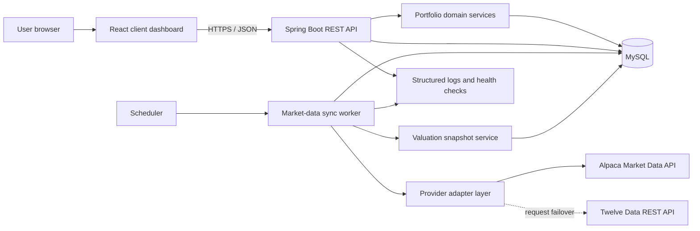
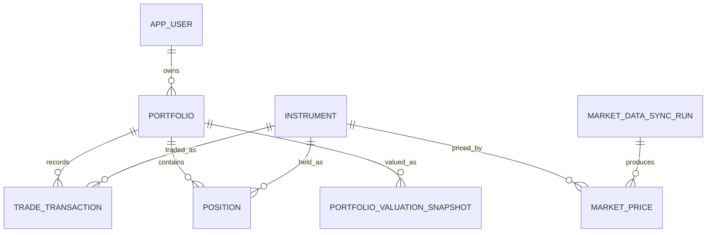

<!-- generated-by: gsd-doc-writer -->

# Portfolio Manager System Architecture

## 1. Document Purpose

This document defines the implementation architecture baseline for Portfolio Manager. It began as the team's development contract and now also describes the implemented system. The original course brief is [project_description.pdf](../project_description.pdf).

The course objective is to let users manage portfolios containing stocks and ETFs; update portfolio value, profit/loss, and asset allocation with real market prices; present allocation with interactive frontend charts; poll daily closing prices in the backend; and demonstrate a client-ready dashboard.

## 2. Goals and Boundaries

### 2.1 MVP Goals

- Manage one or more stock/ETF portfolios.
- Maintain current positions and average cost through buy and sell transactions.
- Calculate market value, unrealized profit/loss, return, and allocation from the latest available daily closing prices.
- Provide a responsive, interactive client dashboard with clear loading, error, and stale-data states.
- Persist and query core system records through REST APIs.
- Synchronize market data daily and permit manual synchronization for demonstrations.
- Continue displaying the last successful prices with a visible status when the external provider is temporarily unavailable.

### 2.2 Explicit MVP Exclusions

- No tick-level order-book stream, WebSocket quotes, or minute-history polling.
  The application synchronizes daily OHLCV history for portfolio valuation.
- No options, bonds, cryptocurrency, short selling, margin, or derivatives.
- No dividend, split, tax, or complex corporate-action processing.
- No multi-currency conversion; MVP portfolios and instruments use USD.
- No production trading execution, investment advice, or regulatory-compliance guarantee.
- Login can be deferred. The MVP may use a seeded demonstration user, while the data model preserves multi-user ownership boundaries.

## 3. Technology Baseline

| Layer | Technology | Rationale |
|---|---|---|
| Web frontend | React, TypeScript, Vite | Component-oriented, fast feedback, and suitable for parallel team development |
| Data fetching | TanStack Query | Consistent caching, refetching, and error states |
| Charts | Chart.js and react-chartjs-2 | Rapid implementation of doughnut charts, line charts, and interactive tooltips |
| API backend | Java 21, Spring Boot 4.1, Spring MVC, Bean Validation | Java LTS baseline with mature layering, validation, and operational support |
| ORM/migrations | Spring Data JPA, Hibernate, Flyway | Separates domain entities, repositories, and database migrations |
| Market-data adapter | Alpaca Market Data with Twelve Data failover behind a provider interface | Supports stock/ETF daily and intraday OHLCV history with provider-specific throttling |
| Polling process | Separate Spring Boot worker with `@Scheduled` | Prevents duplicate work when the web process scales horizontally |
| Database | MySQL 8.0, InnoDB | Exact decimals, transactions, constraints, views, and row-level locking |
| Local runtime | Docker Compose | Consistent frontend, API, worker, and database environment |
| Testing | Vitest, React Testing Library, JUnit, Spring Boot Test, Playwright | Unit, interface, and critical end-to-end coverage |

External market data must be accessed through `MarketDataProvider`; domain calculations must not depend directly on Alpaca or Twelve Data. A provider change replaces only the adapter and configuration, not portfolio calculation rules.

## 4. High-Level Component Diagram



## 5. Component Responsibilities

| Component | Core responsibilities | Not responsible for |
|---|---|---|
| React client dashboard | Layout, portfolio selection, summary cards, position table, allocation chart, historical trend chart, status feedback | Authoritative profit/loss calculation, storing API secrets |
| Spring Boot REST API | Input validation, resource ownership, portfolio/transaction CRUD, aggregated queries, standard errors | Direct third-party market-data calls |
| Portfolio domain services | Trading rules, position updates, cost basis, valuation and allocation calculations | Frontend presentation, scheduling |
| Provider adapter layer | Normalize external data to the internal daily-close model | Writing portfolio transactions, authorization |
| Market-data worker | Scheduled retrieval, batching, retries, idempotent writes, run records | Serving browser requests |
| Valuation snapshot service | Generate daily portfolio value, cost, and profit/loss snapshots after synchronization | Persisting tick data |
| MySQL | Relational constraints, InnoDB transactions, last available prices, analytical views | Calling external APIs |

## 6. Core Data Model



Key rules:

- Transactions are business facts and cannot be edited directly after creation; corrections use reversing or supplemental transactions.
- Current positions are a query projection maintained in the same database transaction as the transaction write.
- A price is unique by instrument + trading date + source; repeated polling uses upsert.
- Each instrument retains multiple days of historical prices; valuation reads the latest valid daily close as appropriate.
- Each portfolio has at most one valuation snapshot per date; regeneration replaces that date's snapshot.
- See [the database schema](database/schema.sql) for detailed DDL, constraints, indexes, and calculation views.

## 7. Critical Data Flows

### 7.1 Create a Portfolio and Record a Buy

1. The user creates a portfolio with USD as its base currency.
2. The user searches for a stock or ETF and chooses quantity, an executable trading time, and fee. The system resolves the actual market price for that time.
3. The API validates instrument status, quantity, execution time/price, and idempotency key.
4. In one transaction, the domain service writes the transaction and inserts or updates position quantity and weighted-average cost.
5. The API returns the normalized position; the frontend refreshes the portfolio summary and allocation chart.
6. If market data is unavailable, the page displays “Awaiting market data” instead of treating the price or profit/loss as zero.

### 7.2 Daily Market-Data Synchronization

1. The scheduler triggers the separate worker after the configured market close.
2. The worker queries instruments in all active positions and creates a synchronization-run record.
3. The provider adapter retrieves approximately one month of daily data one symbol at a time, normalizing symbol, date, currency, close, and source.
4. The worker idempotently upserts every price; one instrument failure does not roll back successful instruments.
5. The worker replays historical transactions by trading day and rebuilds valuation snapshots for affected portfolios.
6. The run record stores successful and failed counts plus an error summary for health checks and the demonstration page.

### 7.3 Dashboard Read

1. The frontend requests portfolio summary, position metrics, allocation, and valuation history.
2. The API calculates authoritative metrics from current positions and market-price views.
3. The API also returns `priceDate`, `fetchedAt`, and `priceStatus`.
4. The frontend renders summary cards, a table, a doughnut chart, and a line chart from the same response version.

### 7.4 External Provider Failure

1. The worker records a diagnosable failure without deleting old prices.
2. The API continues using the last successful price and marks it `STALE`.
3. The frontend shows a visible but non-blocking stale-data warning and the last price date.
4. Instruments that have never received a valid price are `UNAVAILABLE`, are excluded from total value and the allocation denominator, and are listed separately.

## 8. REST API Baseline

All business endpoints use the `/api/v1` prefix. See [API Reference](API.md) for complete request, response, and error examples and [OpenAPI Specification](openapi.yaml) for the machine-readable contract. Development exposes `/docs` and `/v3/api-docs`.

| Method | Path | Purpose | Owner |
|---|---|---|---|
| GET | `/api/v1/portfolios` | List current user's portfolios | Member 2 |
| POST | `/api/v1/portfolios` | Create portfolio | Member 2 |
| GET | `/api/v1/portfolios/{portfolioId}` | Retrieve portfolio | Member 2 |
| PATCH | `/api/v1/portfolios/{portfolioId}` | Update name or description | Member 2 |
| DELETE | `/api/v1/portfolios/{portfolioId}` | Delete empty portfolio | Member 2 |
| POST | `/api/v1/portfolios/{portfolioId}/archive` | Archive portfolio with history | Member 2 |
| POST | `/api/v1/portfolios/{portfolioId}/transactions` | Record buy or sell | Member 3 |
| GET | `/api/v1/portfolios/{portfolioId}/transactions` | Retrieve transaction history | Member 3 |
| GET | `/api/v1/portfolios/{portfolioId}/positions` | Retrieve current positions | Member 3 |
| GET | `/api/v1/instruments?query={text}` | Search stocks and ETFs | Member 3 |
| POST | `/api/v1/market-data/sync` | Trigger synchronization manually | Member 4 |
| GET | `/api/v1/market-data/sync-runs/latest` | Retrieve latest run status | Member 4 |
| GET | `/api/v1/instruments/{instrumentId}/latest-price` | Retrieve latest instrument price | Member 4 |
| GET | `/api/v1/portfolios/{portfolioId}/dashboard` | Return summary, positions, and allocation | Member 5 |
| GET | `/api/v1/portfolios/{portfolioId}/performance` | Retrieve daily valuation series | Member 5 |
| GET | `/health/live` | Process liveness | Member 5 |
| GET | `/health/ready` | Database/dependency readiness | Member 5 |

The standard error body contains a stable code, user-readable message, field errors, and a request-tracing ID. The frontend never depends on Java exception text.

## 9. Metric Definitions

For each position with a valid price:

- `marketValue = quantity × latestClosePrice`
- `costBasis = quantity × averageCost`
- `unrealizedPnl = marketValue - costBasis`
- `returnPct = unrealizedPnl ÷ costBasis × 100`; return null for zero cost
- `allocationPct = positionMarketValue ÷ portfolioPricedMarketValue × 100`

Conventions:

- Quantities, prices, costs, and intermediate calculations use backend `BigDecimal` and database `DECIMAL`, not binary floating point as authoritative values.
- API amounts travel as decimal strings; the frontend formats only for presentation.
- Total market value sums positions with valid prices and also returns the unpriced-position count.
- Sell quantity cannot exceed the current position; negative positions are not allowed in the MVP.
- The fee treatment in average cost and realized profit/loss is frozen in Member 3's unit tests after team agreement.

## 10. Consistency, Idempotency, and Concurrency

- Transaction creation requires a client idempotency key; network retries cannot duplicate buys or sells.
- Lock the corresponding position row during updates; if no row exists, a unique constraint resolves concurrent inserts.
- Transaction and position updates either commit together or roll back together.
- Upsert market data by unique key; the same provider may revise price and fetch time for one trading date.
- The worker uses MySQL `GET_LOCK()`/`RELEASE_LOCK()` so only one end-of-day synchronization runs at a time.
- Generate valuation snapshots only after the run's market data is persisted, avoiding half-batch reads.

## 11. Security and Privacy

- Third-party API keys exist only in API/worker environment variables or secret management, never frontend bundles, logs, or Git.
- The seeded-user mode is explicitly for demonstrations. With multiple users, every portfolio query includes current-user ownership.
- The API uses Bean Validation allow-list validation, request-size limits, and common `@RestControllerAdvice` error handling.
- CORS permits only configured frontend origins; production never uses wildcard origins.
- Logs omit passwords, complete tokens, third-party secrets, and unnecessary personal data.
- Only empty portfolios can be deleted by default; portfolios with history use archive or explicit confirmation.

## 12. Observability and Runtime Status

- Every API request correlates structured logs with `requestId`.
- Synchronization records start/end time, provider, requested/successful/failed counts, and an error summary.
- Health checks distinguish process liveness from dependency readiness; readiness fails when the database is unavailable.
- Core metrics include API error rate, latency, synchronization duration, failed-symbol count, and stale/unavailable position count.
- The demonstration page displays last successful synchronization time and data source.

## 13. Recommended Directory Structure

```text
final_project2/
├─ frontend/              # Member 1: pages, components, API client, frontend tests
│  └─ src/
│     ├─ app/             # Shell, navigation, shared state
│     └─ features/        # portfolios, trading, market-data, analytics
├─ backend/
│  └─ src/main/java/com/portfoliomanager/
│     ├─ api/             # Spring MVC controllers, DTOs, error handling
│     ├─ service/         # Application services and transaction boundaries
│     ├─ domain/          # Enums, JPA entities, financial rules
│     ├─ repository/      # Spring Data JPA repositories
│     └─ config/          # CORS, OpenAPI, runtime configuration
├─ worker/
│  └─ src/main/java/      # Spring scheduling, providers, sync jobs, tests
├─ db/
│  ├─ migrations/         # Flyway migrations owned by Members 2–5
│  └─ seeds/              # Shared local and demonstration seeds
├─ docs/                  # Architecture, PRDs, API/OpenAPI, database design
├─ e2e/                   # Member 1 frontend E2E; Member 5 backend integration
└─ infra/                 # Member 5 CI; team-owned Docker Compose
```

## 14. Five-Person Ownership

One member owns the entire frontend. Four members respectively own the four backend business modules, including MySQL migrations, backend tests, and interface examples.

| Member | Work | PRD | MySQL/backend deliverables | Tests |
|---|---|---|---|---|
| Member 1 | Entire frontend | [PRD 1](prd/01-frontend-application.md) | No backend/database ownership | Frontend unit, component, mocked integration, E2E |
| Member 2 | User and portfolio backend | [PRD 2](prd/02-portfolio-management-backend.md) | User/portfolio tables and APIs; shared Springdoc/OpenAPI | Portfolio API, DB constraints, interface docs |
| Member 3 | Instruments, trading, positions | [PRD 3](prd/03-trading-and-positions-backend.md) | Instrument/transaction/position tables, transactions, APIs | Domain, concurrency, DB, OpenAPI |
| Member 4 | Market-data backend | [PRD 4](prd/04-market-data-backend.md) | Price/run tables, provider, worker, APIs | Provider, locking, failures, DB, OpenAPI |
| Member 5 | Valuation analytics and integration | [PRD 5](prd/05-valuation-and-integration-backend.md) | Snapshots/views, analytics APIs, health, CI | Calculations, contracts, full MySQL, integration |

Collaboration rules:

- Member 1 integrates with the four backend members only through [OpenAPI](openapi.yaml).
- Members 2–5 maintain their interfaces' request models, response models, error codes, and examples.
- Member 2 owns the Springdoc entry point; Member 5 compares runtime `/v3/api-docs` with the repository contract in CI.
- The backend owner of each table writes its migrations; Member 5 validates the complete migration order against an empty database.
- Backend contract changes update OpenAPI first, then notify Member 1 to regenerate or validate frontend types.

## 15. MVP Definition of Done

- Create a portfolio and record buys for at least one stock and one ETF.
- Reject invalid quantity, invalid execution conditions, duplicate idempotency keys, and overselling.
- Retrieve daily closing prices from a real external provider and persist them.
- Display total market value, cost, unrealized profit/loss, return, and allocation percentages.
- Display an allocation doughnut chart and a historical valuation line chart.
- Distinguish `FRESH`, `STALE`, and `UNAVAILABLE` market-data states.
- When external synchronization fails, existing portfolios still open and display the last available prices.
- REST APIs expose accessible OpenAPI documentation with basic error examples.
- Unit tests, API integration tests, and a critical end-to-end test pass.
- All five members have independent demonstrable deliverables and can explain interface boundaries.

## 16. Primary Risks and Mitigations

| Risk | Impact | Mitigation |
|---|---|---|
| Free provider rate limits or schema changes | Synchronization or live demonstration fails | Provider abstraction, one-symbol historical requests, caching, fixture provider, last available price |
| Calling daily closes “live streaming” | Misrepresents product behavior | Show price date/source and consistently say “latest available daily close” |
| Interface churn across five parallel owners | Integration delay | Freeze OpenAPI and key database fields first; enforce contract tests |
| Floating-point financial errors | Inconsistent profit/loss and percentages | Backend `BigDecimal`, database `DECIMAL`, shared rounding tests |
| Worker runs in multiple instances | Rate limits or duplicate writes | Separate worker, MySQL named lock, unique-key upsert |
| Excessive scope | Core demonstration cannot close the loop | Complete a USD, long-only, stock/ETF, daily-price vertical slice first |

## 17. Team Decisions Still Required

- Confirm the production Alpaca feed subscription; retain Twelve Data fallback
  quota and the offline fixture provider for degraded/offline operation.
- Confirm market time zone and trading calendar for end-of-day jobs.
- Freeze fee treatment in average cost and realized profit/loss.
- Decide whether MVP includes login and, if not, how to initialize the demonstration user.
- Select the demonstration deployment platform, domain, and resource specifications. <!-- VERIFY: deployment platform, domain, and resource specifications remain undecided -->
